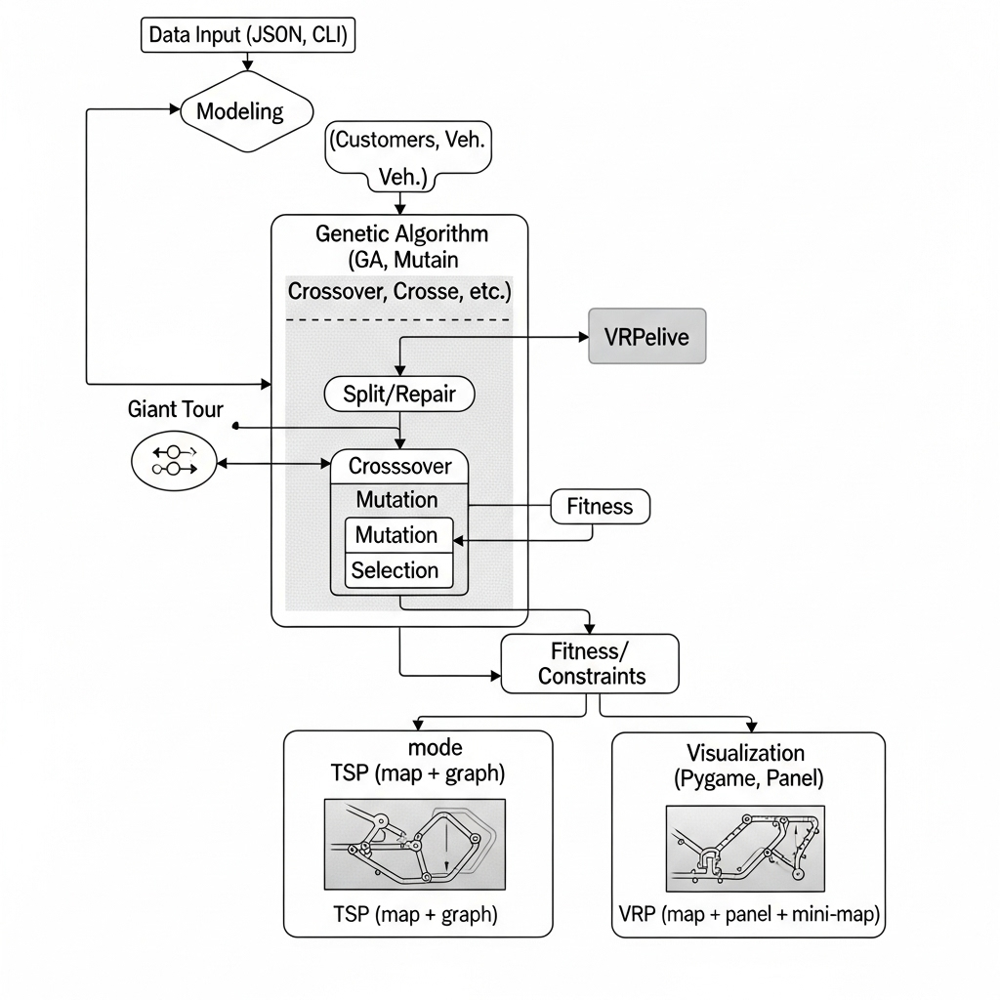

# Tech Challenge Fase 2 – Genetic Algorithm TSP & VRP

## Descrição do Projeto

Este projeto implementa solucionadores para o Problema do Caixeiro Viajante (TSP) e o Problema de Roteamento de Veículos (VRP) usando Algoritmos Genéticos, com visualização interativa em Pygame e suporte a restrições reais (capacidade, janelas de tempo, refrigeração, tempo máximo de rota).

## Funcionalidades
- TSP: busca da menor rota para visitar todas as cidades.
- VRP: distribuição de clientes em múltiplas rotas com restrições operacionais.
- Visualização gráfica do processo evolutivo e das soluções.
- CLI para ajuste de parâmetros e restrições.

## Estrutura do Projeto



## Instalação e Execução

### 1. Pré-requisitos
- Python 3.10+
- pip

### 2. Ambiente Virtual (Recomendado)
Crie e ative o ambiente virtual **antes de instalar qualquer pacote**:
```bash
python3 -m venv .venv
source .venv/bin/activate  # Linux/macOS
.venv\Scripts\activate    # Windows
```

### 3. Instale as dependências no ambiente virtual
```bash
pip install pygame==2.6.0 requests flask
```

### 4. Execução

#### TSP
```bash
python tsp.py
```

#### VRP (sem visualização)
```bash
python vrp_ga.py --data sample_vrp.json --gens 10 --pop-size 20 --mutation 0.5
```

#### VRP (com visualização)
```bash
python vrp_ga.py --data sample_vrp.json --gens 10 --pop-size 20 --mutation 0.5 --visualize
```

#### Ajuste de restrições (opcional)
```bash
python vrp_ga.py --data sample_vrp.json --gens 100 --w-cap 1000 --w-tw 500 --w-refrig 5000 --w-mrt 200 --visualize
```

#### Integração com LLM (Gemini)
Exportar a chave da API Gemini:
```bash
export GEMINI_API_KEY="SUA_CHAVE"
```

##### CLI:
```bash
python llm_cli.py instrucoes --rota "Rota otimizada: ..."
python llm_cli.py relatorio --dados "Dados agregados das rotas"
python llm_cli.py melhorias --historico "Histórico de rotas"
python llm_cli.py pergunta --pergunta "Qual a rota mais eficiente?" --contexto "Dados das rotas"
```

##### Web:
```bash
python llm_web.py
```
Acesse http://localhost:5000 no navegador.

## Controles da Visualização
- `Q`: sair
- `P`: mostrar/ocultar painel lateral
- `C`: modo compacto
- Setas Cima/Baixo ou roda do mouse: rolagem vertical
- Setas Esquerda/Direita ou Shift + roda do mouse: rolagem horizontal
- PageUp/PageDown: paginação
- `+`/`-` ou Ctrl + roda: zoom
- `0`: resetar zoom/pan
- `W/A/S/D`: pan no mapa

## Saídas e Resultados
- Console: fitness por geração, tempo total, penalidades.
- Janela Pygame: mapa, rotas, gráfico de fitness (TSP), painel de métricas (VRP), tooltip detalhado.
- LLM: instruções, relatórios, sugestões e respostas em linguagem natural.

## Licença
MIT

## Autor
Juliana Conde
